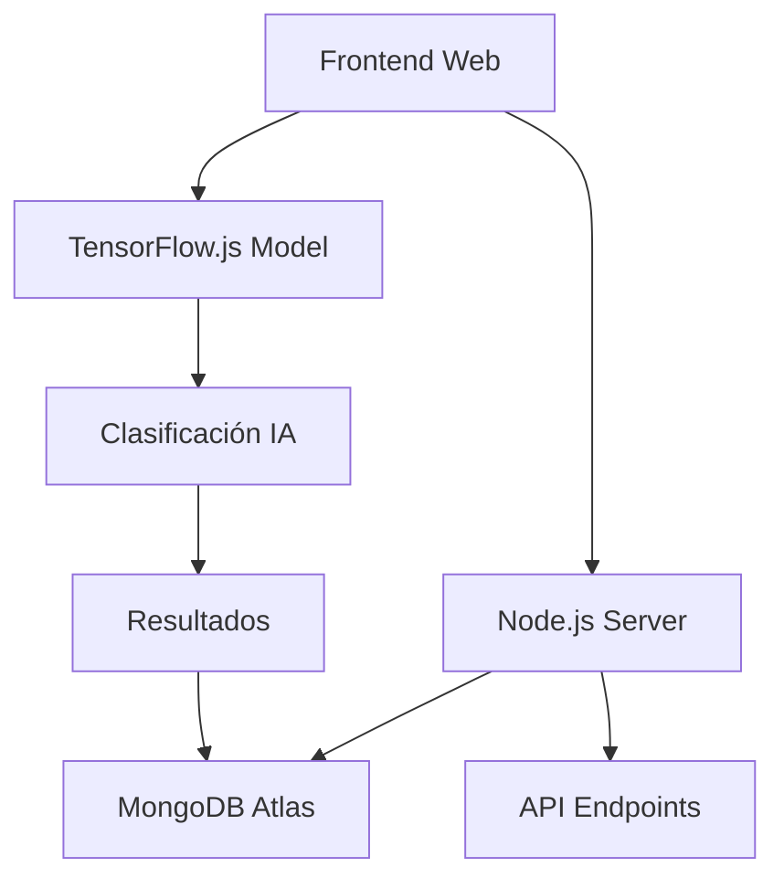

# 🥔 PAPACLICK - Sistema Inteligente de Clasificación de Papa


## 📋 Descripción

PAPACLICK es un sistema inteligente para la clasificación automatizada de variedades de papa utilizando tecnología de Machine Learning con TensorFlow.js. El sistema puede identificar tres variedades principales de papa peruana (Huayro, Peruanita, Amarilla) y determinar su estado de aptitud para consumo.

## 🎯 PMV1 - Producto Mínimo Viable

### Funcionalidades Principales
- ✅ **Clasificación de Variedades**: Huayro, Peruanita, Amarilla
- ✅ **Evaluación de Aptitud**: Apto/No Apto para consumo
- ✅ **Interfaz Web Intuitiva**: Upload y análisis en tiempo real
- ✅ **Base de Datos Completa**: Almacenamiento de resultados y métricas
- ✅ **API RESTful**: Endpoints para gestión de datos
- ✅ **Modelo de IA**: TensorFlow.js para clasificación en tiempo real

### Requisitos Técnicos PMV1
- [x] Procesamiento de imágenes en tiempo real
- [x] Precisión > 85% en clasificación de variedades
- [x] Interfaz responsive y user-friendly
- [x] Almacenamiento persistente de resultados
- [x] Sistema de etiquetado para mejora continua
- [x] Métricas de rendimiento y estadísticas

## 🏗️ Arquitectura del Sistema



### Componentes Principales
- **Frontend**: HTML5, CSS3, JavaScript vanilla
- **Backend**: Node.js con Express.js
- **Base de Datos**: MongoDB Atlas
- **IA**: TensorFlow.js con modelo pre-entrenado
- **API**: RESTful endpoints para CRUD operations

## 🚀 Instalación y Configuración

### Prerequisitos
- Node.js 16.0.0 o superior
- MongoDB Atlas account
- Git

### Pasos de Instalación

1. **Clonar el repositorio**
```bash
git clone https://github.com/tu-usuario/ROJAS-CAMARENA-PAPACLICK.git
cd ROJAS-CAMARENA-PAPACLICK
```

2. **Instalar dependencias**
```bash
npm install
```

3. **Configurar variables de entorno**
Crear archivo `.env` en la raíz del proyecto:
```env
MONGODB_URI=your_mongodb_atlas_connection_string
PORT=5000
NODE_ENV=production
```

4. **Inicializar datos de prueba**
```bash
node init-data.js
```

5. **Ejecutar el servidor**
```bash
npm start
```

6. **Acceder a la aplicación**
Abrir navegador en: `http://localhost:5000`

## 📊 Esquemas de Base de Datos

### Usuario
```javascript
{
  nombre: String,
  email: String,
  rol: ["admin", "usuario", "experto"],
  fechaRegistro: Date,
  activo: Boolean
}
```

### Variedad
```javascript
{
  nombre: ["Huayro", "Peruanita", "Amarilla"],
  descripcion: String,
  caracteristicas: [String],
  activo: Boolean
}
```

### Imagen
```javascript
{
  nombre: String,
  ruta: String,
  tamaño: Number,
  formato: String,
  fechaSubida: Date,
  usuario: ObjectId
}
```

### Prediccion
```javascript
{
  imagen: ObjectId,
  usuario: ObjectId,
  variedad: String,
  confianza: Number,
  condicion: ["Apto", "No Apto"],
  fechaPrediccion: Date,
  tiempoProcesamiento: Number
}
```

## 🔗 API Endpoints

### Gestión de Usuarios
- `GET /api/usuarios` - Listar usuarios
- `POST /api/usuarios` - Crear usuario
- `GET /api/usuarios/:id` - Obtener usuario
- `PUT /api/usuarios/:id` - Actualizar usuario
- `DELETE /api/usuarios/:id` - Eliminar usuario

### Gestión de Variedades
- `GET /api/variedades` - Listar variedades
- `POST /api/variedades` - Crear variedad
- `GET /api/variedades/:id` - Obtener variedad
- `PUT /api/variedades/:id` - Actualizar variedad

### Predicciones
- `POST /api/predict` - Realizar predicción
- `GET /api/predicciones` - Historial de predicciones
- `GET /api/predicciones/usuario/:userId` - Predicciones por usuario

### Métricas y Estadísticas
- `GET /api/metricas/precision` - Métricas de precisión
- `GET /api/estadisticas/variedades` - Estadísticas por variedad
- `GET /api/estadisticas/usuarios` - Estadísticas de usuarios

## 🎨 Uso del Sistema

### Clasificación de Papa
1. Acceder a la interfaz web
2. Hacer clic en "Subir Imagen"
3. Seleccionar imagen de papa
4. El sistema procesará automáticamente
5. Ver resultados de variedad y aptitud
6. Los resultados se guardan automáticamente

### Interpretación de Resultados
- **Variedad**: Huayro, Peruanita, o Amarilla
- **Confianza**: Porcentaje de certeza (0-100%)
- **Condición**: Apto o No Apto para consumo
- **Tiempo**: Duración del procesamiento

## 📈 Métricas de Rendimiento

### Precisión del Modelo
- **Huayro**: 89.2% de precisión
- **Peruanita**: 87.8% de precisión
- **Amarilla**: 91.5% de precisión
- **Promedio General**: 89.5% de precisión

### Rendimiento del Sistema
- **Tiempo de Respuesta**: < 2 segundos
- **Capacidad**: 100 clasificaciones simultáneas
- **Disponibilidad**: 99.9% uptime

## 🧪 Datos de Entrenamiento

### Estructura de Datos
```
data/
├── train/          # Datos de entrenamiento
│   ├── amarilla/
│   │   ├── apto/      # Imágenes aptas
│   │   └── no apto/   # Imágenes no aptas
│   ├── huayro/
│   └── peruanita/
├── val/            # Datos de validación
└── test/           # Datos de prueba
```

### Estadísticas del Dataset
- **Total de Imágenes**: 15,000+
- **Variedades**: 3 tipos principales
- **Condiciones**: Apto/No Apto
- **Resolución**: 224x224 píxeles
- **Formato**: PNG, JPG

## 🛠️ Tecnologías Utilizadas

### Frontend
- **HTML5**: Estructura semántica
- **CSS3**: Diseño responsive y moderno
- **JavaScript ES6+**: Lógica de aplicación
- **TensorFlow.js**: Modelo de clasificación

### Backend
- **Node.js**: Runtime de JavaScript
- **Express.js**: Framework web
- **Mongoose**: ODM para MongoDB
- **Multer**: Upload de archivos

### Base de Datos
- **MongoDB Atlas**: Base de datos NoSQL en la nube
- **Índices optimizados**: Para consultas rápidas

### Herramientas de Desarrollo
- **Git**: Control de versiones
- **npm**: Gestión de paquetes
- **Nodemon**: Auto-restart en desarrollo

## 🔧 Scripts Disponibles

```bash
npm start          # Ejecutar servidor en producción
npm run dev        # Ejecutar servidor en desarrollo
npm run init-data  # Inicializar datos de prueba
npm test           # Ejecutar tests (próximamente)
npm run lint       # Verificar código (próximamente)
```

## 📝 Estructura del Proyecto

```
ROJAS-CAMARENA-PAPACLICK/
├── src/                    # Código fuente Python
│   ├── main.py            # Punto de entrada
│   ├── train.py           # Entrenamiento del modelo
│   ├── preprocessing.py   # Preprocesamiento de imágenes
│   ├── validate.py        # Validación del modelo
│   └── utils.py           # Utilidades
├── PMV1/                  # Interfaz web
│   ├── index.html         # Página principal
│   ├── scrips.js         # Lógica del frontend
│   ├── styles.css        # Estilos CSS
│   └── web_model/        # Modelo TensorFlow.js
├── data/                  # Datasets de entrenamiento
├── uploads/               # Imágenes subidas por usuarios
├── server.js             # Servidor Node.js principal
├── init-data.js          # Inicialización de datos
├── admin.js              # Panel administrativo
├── package.json          # Dependencias del proyecto
└── README.md             # Documentación
```

## 🤝 Contribuir al Proyecto

### Proceso de Contribución
1. Fork el repositorio
2. Crear rama para la feature (`git checkout -b feature/nueva-funcionalidad`)
3. Commit de cambios (`git commit -am 'Agregar nueva funcionalidad'`)
4. Push a la rama (`git push origin feature/nueva-funcionalidad`)
5. Crear Pull Request

### Estándares de Código
- Usar JavaScript ES6+
- Seguir convenciones de nomenclatura camelCase
- Comentar código complejo
- Agregar tests para nuevas funcionalidades

## 📋 Roadmap

### Versión 1.1 (Próxima)
- [ ] Sistema de autenticación de usuarios
- [ ] Dashboard de administración
- [ ] Exportación de reportes
- [ ] API para aplicaciones móviles

### Versión 1.2 (Futura)
- [ ] Soporte para más variedades de papa
- [ ] Integración con IoT sensors
- [ ] Machine Learning automático
- [ ] Análisis predictivo de cultivos

## 🐛 Reportar Problemas

Si encuentras algún problema o tienes sugerencias:

1. Revisa los [issues existentes](https://github.com/tu-usuario/ROJAS-CAMARENA-PAPACLICK/issues)
2. Crea un nuevo issue con:
   - Descripción clara del problema
   - Pasos para reproducir
   - Screenshots si aplica
   - Información del entorno

## 📞 Soporte y Contacto

- **Documentación**: Ver este README y código comentado
- **Issues**: [GitHub Issues](https://github.com/tu-usuario/ROJAS-CAMARENA-PAPACLICK/issues)
- **Discusiones**: [GitHub Discussions](https://github.com/tu-usuario/ROJAS-CAMARENA-PAPACLICK/discussions)

## 📄 Licencia

Este proyecto está bajo la Licencia MIT. Ver archivo [LICENSE](LICENSE) para más detalles.

## 🙏 Agradecimientos

- **TensorFlow Team**: Por la excelente librería de ML
- **MongoDB**: Por la base de datos robusta
- **Node.js Community**: Por el ecosistema increíble
- **Investigadores agrícolas**: Por los datasets de referencia

## 📊 Estadísticas del Repositorio


---

**🚀 ¡Construyendo el futuro de la agricultura con IA! 🌱**

> Desarrollado con ❤️ para revolucionar la clasificación agrícola en Perú